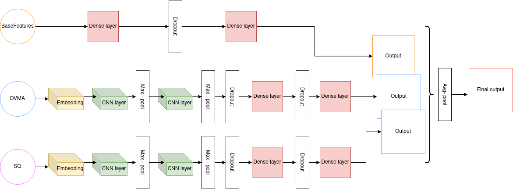

# Syllabic Quantity Patterns as Rhythmic Features for Latin Authorship Attribution

## Abstract

Within the Latin (and ancient Greek) production, it is well known that peculiar metric schemes were followed not only in poetic compositions, but also in many prose works. Such metric patterns were based on <em>syllabic quantity</em>, i.e., on on the length of the involved syllables (which can be long or short), and there is much evidence suggesting that certain authors held a preference for certain rhythmic schemes over others.  
In this project, we investigate the possibility to employ syllabic quantity as a base to derive rhythmic features for the task of computational Authorship Attribution of Latin prose texts. We test the impact of these features on the attribution task when combined with other topic-agnostic features, employing three datasets and two different learning algorithms.

## Syllabic Quantity for Authorship Attribution

Authorship Attribution (AA) is a subtask of the field of Authorship Analysis, which aims to infer various characteristics of the writer of a document, its identity included. In particular, given a set of candidate authors <em>A1... Am</em> and a document <em>d</em>, the goal of AA is to find the most probable author for the document <em>d</em> among the set of candidates; AA is thus a single-label multi-class classification problem, where the classes are the authors in the set.  
In this project, we investigate the possibility to employ features extracted from the quantity of the syllables in a document as discriminative features for AA on Latin prose texts. Syllables are sound units a single word can be divided into; in particular, a syllable can be thought as an oscillation of sound in the word pronunciation, and is characterized by its quantity (long or short), which is the amount of time required to pronounce it. It is well known that classical Latin (and Greek) poetry followed metric patterns based on sequences of short and long syllables. In particular, syllables were combined in what is called a "foot", and in turn a series of "feet" composed the metre of a verse. Yet, similar metric schemes were followed also in many prose compositions, in order to give a certain cadence to the discourse and focus the attention on specific parts. In particular, the end of sentences and periods was deemed as especially important in this sense, and known as <em>clausola</em>. During the Middle Ages, Latin prosody underwent a gradual but profound change. The concept of syllabic quantity lost its relevance as a language discriminator, in favour of the accent, or stress. However, Latin accentuation rules are largely dependent on syllabic quantity, and medieval writers retained the classical importance of the clausola, which became based on stresses and known as <em>cursus</em>. An author's practice of certain rhythmic patterns might thus play an important role in the identification of that author's style.

## Datasets

In this project, we employ 3 different datasets:
<ul>
<li><strong>LatinitasAntiqua</strong>. The texts can be automatically downloaded with the script in the corresponding code file (<em>src/dataset_prep/LatinitasAntiqua_prep.py</em>). They come from the <em>Corpus Corporum</em> repository, developed by the
University of Zurich, and in particular its sub-section called <em>Latinitas antiqua</em>, which contains various Latin works from the Perseus Digital library; in total, the corpus is composed of 25 Latin authors and 90 prose texts, spanning through the Classical, Imperial and Early-Medieval periods, and a variety of genres (mostly epistolary, historical and rhetoric).</li>
<li><strong>KabalaCorpusA</strong>. The texts can be downloaded from the followig [link](https://www.jakubkabala.com/gallus-monk/). In particular, we use Corpus A, which consists of 39 texts by 22 authors from the 11-12th century.</li>
<li><strong>MedLatin</strong>. The texts can be downloaded from the following link: <https://zenodo.org/record/3903296#.YR_aN1uxXys>. Originally, the texts were divided into two datasets, but we combine them together. Note that we exclude the texts from the collection of Petrus de Boateriis, since it is a miscellanea of authors. We delete the quotations from other authors and the insertions in languages other than Latin, marked in the texts.</li>
</ul>
The documents are automatically pre-processed in order to clean them from external information and noise. In particular, headings, editors' notes and other meta-information are deleted where present. Symbols (such as asterisks or parentheses) and Arabic numbers are deleted as well. Punctuation marks are normalized: every occurrence of question and exclamation points, semicolons, colons and suspension points are exchanged with a single point, while commas are deleted. The text is
finally lower-cased and normalized: the character <em>v</em> is exchanged with the character <em>u</em> and the character <em>j</em> with the character <em>i</em>, and every stressed vowels is exchanged with the corresponding non-stressed vowel. As a final step, each text is divided into sentences, where a sentence is made of at least 5 distinct words (shorter sentences are attached to the next sentence in the sequence, or the previous one in case it is the last one in the document). This allows to create the fragments that ultimately form the training, validation and and test sets for the algorithms. In particular, each fragment is made of 10 consecutive, non-overlapping sentences.

## Experiments

In order to transform the Latin texts into the corresponding syllabic quantity (SQ) encoding, we employ the prosody library available on the [Classical Language ToolKit](http://cltk.org/). 
We also experiment with the four Distortion Views presented by [Stamatatos](https://asistdl.onlinelibrary.wiley.com/doi/full/10.1002/asi.23968?casa_token=oK9_O2SOpa8AAAAA%3ArLsIRzk4IhphR7czaG6BZwLmhh9mk4okCj--kXOJolp1T70XzOXwOw-4vAOP8aLKh-iOTar1mq8nN3B7), which, given a list <em>Fw</em> of function words, are:
<ul>
<li><strong>Distorted View – Multiple Asterisks (DVMA)</strong>: every word not included in <em>Fw</em> is masked by replacing each of its characters with an asterisk.</li>
<li><strong>Distorted View – Single Asterisk (DVSA)</strong>: every word not included in <em>Fw</em> is masked by replacing it with a single asterisk.</li>
<li><strong>Distorted View – Exterior Characters (DVEX)</strong>: every word not included in <em>Fw</em> is masked by replacing each of its characters with an asterisk, except the first and last one.</li>
<li><strong>Distorted View – Last 2 (DVL2)</strong>: every word not included in <em>Fw</em> is masked by replacing each of its characters with an asterisk, except the last two characters.</li>
</ul
Henceforth, we obtain 5 different encodings for each document. From these, we can extract different features and experiment with them through combination. Moreover, we employ a set of features that do not originate from a distortion method, so that we have a common base for each classifier. We call it <strong>BaseFeatures</strong> (BFs) and it's made of: function words, word lengths, sentence lengths.  
We experiment with two different learning methods: Support Vector Machine and Neural Network. All the experiments are conducted on the same train-validation-test split. 
For the former, we compute the TfIdf of the character n-grams in various ranges, extracted from the various encodings of the text, which we concatenate to BaseFeatures, and feed the resulting features matrix to a LinearSVC implemented in the [scikit-learn package](https://scikit-learn.org/stable/modules/generated/sklearn.svm.LinearSVC.html). 
For the latter, we compute various parallel, identical branches, each one processing a single encoding or the Bfs matrix, finally combining the different outputs into a single decision layer. The network is implimented with the [PyTorch package](https://pytorch.org/). Each branch outputs a matrix of probabilities, which are stacked together, and an average-pooling operation is applied in order to obtain the average value of the decisions of the different branches. The final decision is obtained through a final dense layer applying a softmax (for training) or argmax (for testing) operation over the classes probabilities. The training of the network is conducted with the traditional backpropagation method; we employ cross-entropy as the loss function and the Adam optimizer. 
We employ the macro-F1 and micro-F1 as measures in order to assess the performance of the methods. For each method employing SQ-based features, we compute the statistical significance against its baseline (the same method without SQ-based features); to this aim, we employ the McNemar's paired non-parametric statistical hypothesis test, taking $0.05$ as significance value.

## Code 

The code is organized as follows int the <em>src</em> directory:
<ul>
<li><strong>NN_models</strong>: the directory contains the code to build the Neural Networks tried in the project, one file for each architecture. The one finally used in the project is in the file <em>NN_cnn_deep_ensemble.py</em>.</li>
<li><strong>dataset_prep</strong>: the directory contains the code to preprocess the various dataset employed in the project. The file <em>NN_dataloader.py</em> prepares the data to be processed for the Neural Network.</li>
<li><strong>general</strong>: the directory contains: a) <em>helpers.py</em>, with various functions useful for the current project; b) <em>significance.py</em>, with the code for the significance test; c) <em>utils.py</em>, with more comme useful functions; d) <em>visualization.py</em>, with functions for drawing graphics and similar.</li>
<li><em>NN_classification.py</em>: it performs the Neural Networks experiments.</li>
<li><em>SVM_classification.py</em>: it performs the Support Vector Machine experiments.</li>
<li><em>feature_extractor.py</em>: it extract the features for the SVM experiments.</li>
<li><em>main.py</em>
</ul>

